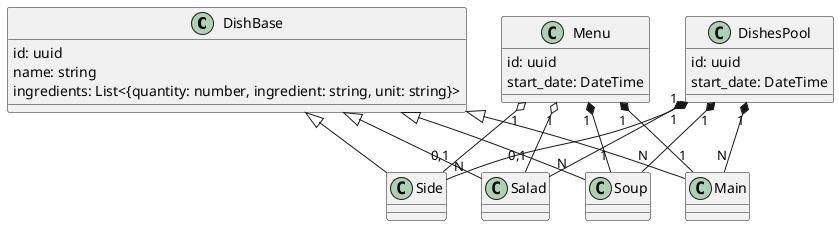
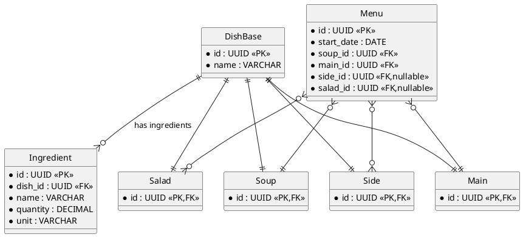
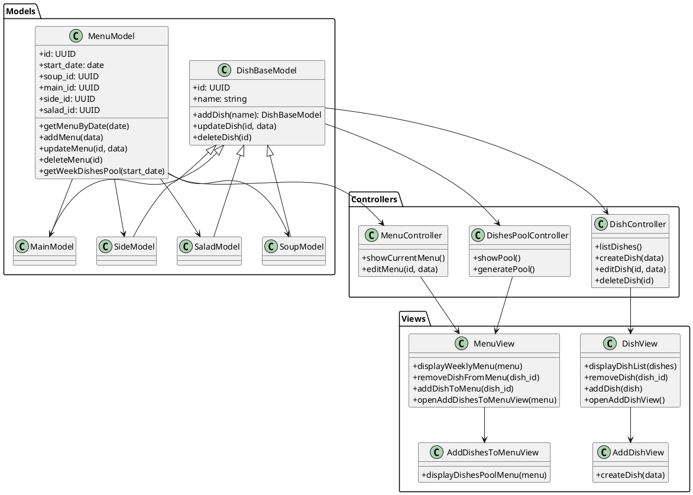

# Cantina

## Cantina requirements

1. Overview
   1. Purpose: Cantina is a web application that allows users to view and interact with weekly menus offered by a canteen. It provides functionality to view upcoming menus, select meals for upcoming days, and contribute new dishes or menus to a shared pool.
   1. Scope: The first version of Cantina focuses on read and write operations without user accounts or authentication. All users share the same access level and data visibility.

1. Functional Requirements
   1. Accessibility
      1. The application must be publicly accessible without login or registration.
      1. All users share the same interface and data (no personalization or authentication).

   1. Menu Viewing
      1. The user can view the menu plan for the next 7 days.
      1. Each daily menu displays:
         - Soup
         - Main dish
         - Side dish
         - Salad
      1. If no menu is set for a specific day, the UI should indicate it (e.g. “No menu available”).

   1. Menu Selection
      1. The user can select 1 to 7 menus (one per day) from the available group of menus for the upcoming week.
      1. A selection is limited to the current week’s menu pool.
      1. Once a menu's are selected, the user can:
      1. Add to the selection (until the end of the week)
      1. Remove from the selection (until the end of the week)
      1. Clear their selection

   1. Weekly Menu Pool
      1. Each week, there exists a pre-selected group of menus (the “menu pool”) from which users can choose.
      1. The menu pool changes every week.
      1. The weekly pool is stored in a database and can be updated by any user.

   1. Menu Pool Management
      1. Users can manage the pool of possible menus:
      1. Add Menu: Create a new menu composed of a soup, main dish, side dish, and salad.
      1. Edit Menu: Modify any component (soup, main dish, side dish, salad) of an existing menu.
      1. Delete Menu: Remove a menu from the pool.

   1. Dish Management
      1. The user can add new dishes (soups, mains, sides, salads) to the system.
      1. These dishes become available for inclusion in future menus.

1. Non-Functional Requirements
   1. Usability
      1. Simple, minimal interface accessible via modern web browsers.
      1. Menu selection should require minimal clicks/taps.

   1. Reliability
      1. Weekly data (menus and selections) must persist between sessions.
      1. Weekly resets (new menu pool) occur automatically or through admin input.

## Cantina class diagram

## Cantina databse diagram

## Cantina MVC

